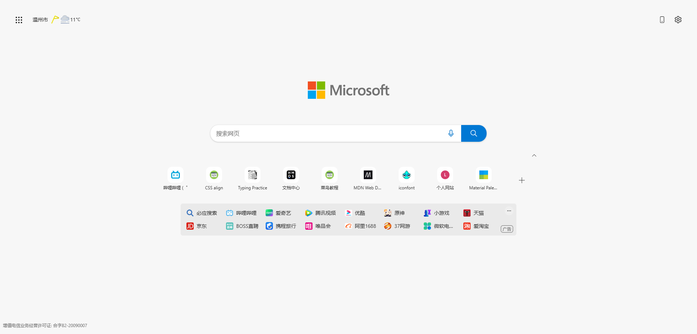
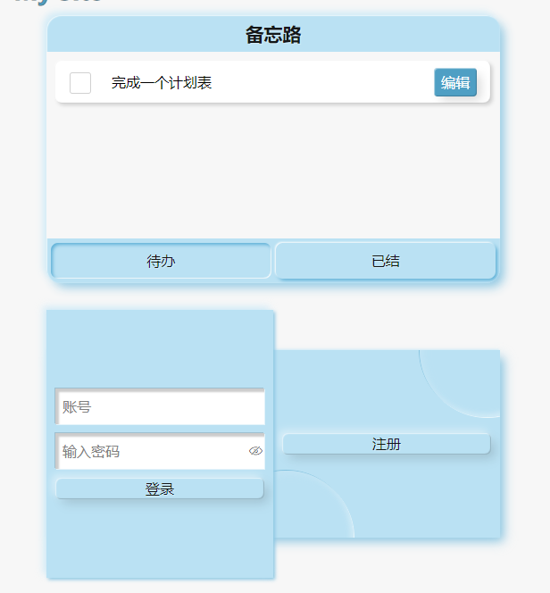
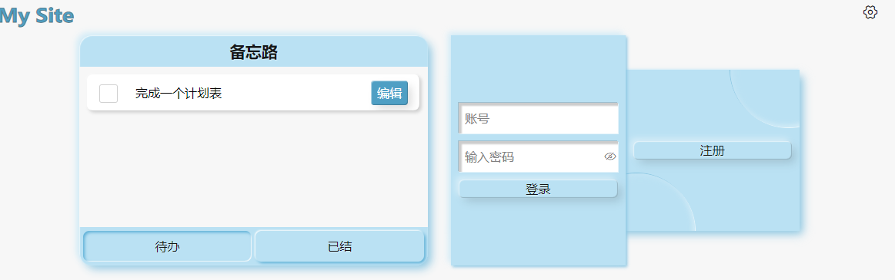

# MySite

一个简单的首页,用于存储书签以及个人笔记,异地登录,临时办公,能通过该网站快速部署常用工具 [详见](https://zhangruisite.com).
   
灵感来edge首页


## 一.功能特色

1. 模块区设计,可拓展组件(目前支持备忘录).
2. 搜索工具(目前支持百度,bing).
3. 书签栏,使用递归组件可以无限嵌套.

## 二.布局逻辑及实现

1. 总体布局
采用grid设计,分四行,头尾使用`1fr`平分剩余空间,其余由内容决定,同时设置总体高度100%避免被1fr撑开,详见[^fr]. 
[^fr]: **注意:**多处设置fr时的表现,假设两个网格行高为1fr 1fr,若父级未指定高度,则两处行高始终相等**即低的网格高度始终被更高的网格拉伸**,此时便会撑开父类,若父级设置高度且高度不足两者平分时,高度大的网格行高不变,剩余空间全部分配给行高小的网站,直至二者高度相等.
```scss
  .body {
    height: 100%;
    display: grid;
    grid-template-rows: 1fr auto auto 1fr;
    gap: 10px;
    place-items: center;
    font-size: 16px;
  }
```
2. 响应式设计
每个`grid-item`都配置统一类名`.container`,通过媒体查询器动态修改`max-width`及`padding`实现各区域统一宽度表现.**此处也可通过父类设置`padding`及`flex`实现类似效果**
```scss
  .container {
    /* 设置100%未达到最大宽度时显示沾满 */
    max-width: 80%;
    box-sizing: border-box;
    width: 100%;
    /* 设置块元素的左右居中 */
    margin: 0 auto;
    /* 设置当宽度压缩的时候保证内容和边界仍有空间 */
    padding-right: 16px;
    padding-left: 16px;
  }
```
3. 组件设计
每个`grid-item`都是一个组件,通过`grid-row`属性指定自身位置,其中footer部分使用尾端对齐
```scss
  .footer {
    grid-row: -2;
    place-self: end start;
  }
```
4. 小组件
小组件统一置于文档底部,通过`absolute`自由调整位置,在相应`grid-item`内通过`padding`空出空间

## 三.模块设计

- 得益于vue强大的[SFC](https://cn.vuejs.org/guide/scaling-up/sfc.html "单文件组件")系统,网站中各部分`grid-item`及小组件都是一个SFC,源码文档结构简单,可读性强,多端适配简单,大屏时可将多个组件置于同一页面,小程序端时也可看需求将组件分为多个page展示

- 首页第一个区域也做模块区域设计,可通过选取不同组件实现个性化定制,其核心是通过`grid`布局`auto-fill`实现动态调整
```scss
.module {
    height: 100%;
    grid-row: 1;
    align-self: end;
    /* 为小组件空出位置 */
    padding-top: 60px;
    display: grid;
    grid-template-columns: repeat(auto-fill, minmax(350px, 1fr));
    gap: 30px;
    .memo {
      height: 300px;
      max-height: 300px;
    }
    .login {
      height: 300px;
    }
  }
```


## 三.问题和思考

1. H5中通过`:hover,:active`等伪类选择器,可以轻松的实现组件聚焦及失焦时的样式切换,而小程序端该怎么判断呢?
 - 例如:小程序中点击设置出现选项,点击其他取消选项
 - 思路:组件内部设置一层覆盖全局透明遮罩,当聚焦时显示这个遮罩,当遮罩被点击时抛出事件,通知组件失焦,再通过增减组件根元素上的类名来实现不同状态下的组件表现
```scss
<template>
  <view class="mask"></view>
</template>
<script setup lang="ts">
</script>
<style scoped lang="scss">
  .mask {
    position: fixed;
    width: 100vw;
    height: 100vh;
    top: 0;
    left: 0;
    background-color: transparent;
  }
</style>
```

2. uniapp中动态增加的组件如果判断其所处位置?
 - 举例:书签为递归组件,其子类容器在点击会动态显示在页面,怎么判断书签左右上下空间是否足够其显示?
 - 思路:通过查询设备高宽和组件信息,得出组件的的位置信息,再通过对比设置子容器的`absolute`定位.
 
 ```javascript
 import { ComponentInternalInstance } from "vue"
 interface ClientInfo {
   clientLeft: number;
   clientRight: number;
   clientTop: number;
   clientBottom: number;
   clientWidth: number;
   clientHeight: number;
   windowWidth: number;
   windowHeight: number;
 }
 /** 
 @param{string}selector 一个css选择器
 @param{ComponentInternalInstance}self 当前组件实例对象
 @returns Promise 返回组件相对视口位置,自身及设备高宽,
 */
 function getClientInfo(selector: string, self: ComponentInternalInstance): Promise<ClientInfo> {
   return new Promise(res => {
     uni.createSelectorQuery().in(self).select(selector)
       .boundingClientRect(
       ).exec((data) => {
         data = data[0];
         let { windowWidth: wW, windowHeight: wH } = uni.getSystemInfoSync() as UniNamespace.GetSystemInfoResult
         let { height: h, width: w, left: l, top: t } = (data as UniNamespace.NodeInfo)
         let r = wW - l - w
         let b = wH - t - h
         let info: ClientInfo = { clientLeft: l, clientRight: r, clientTop: t, clientBottom: b, clientWidth: w, clientHeight: h, windowWidth: wW, windowHeight: wH }
         res(info)
       })
   })
 
 }
 export { getClientInfo, ClientInfo }
```
